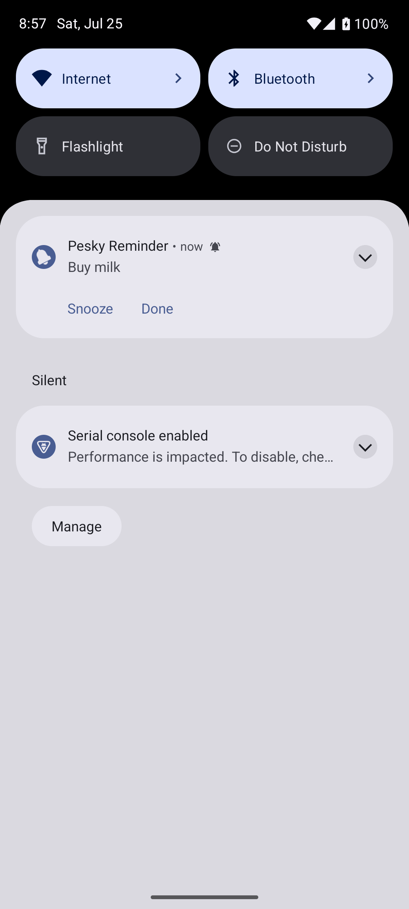
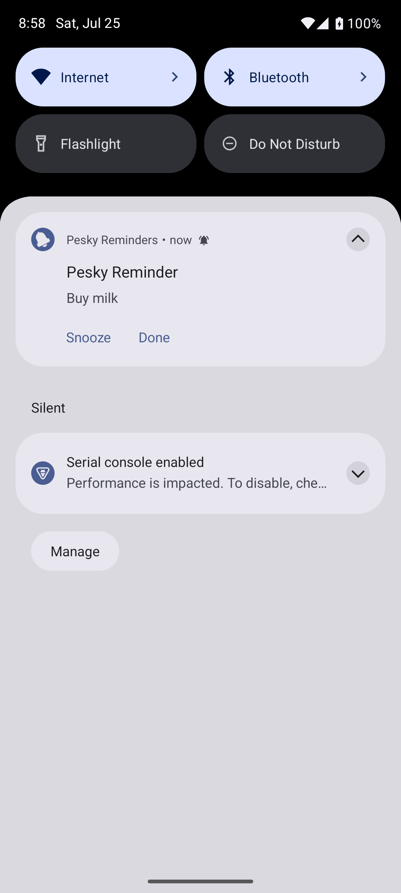
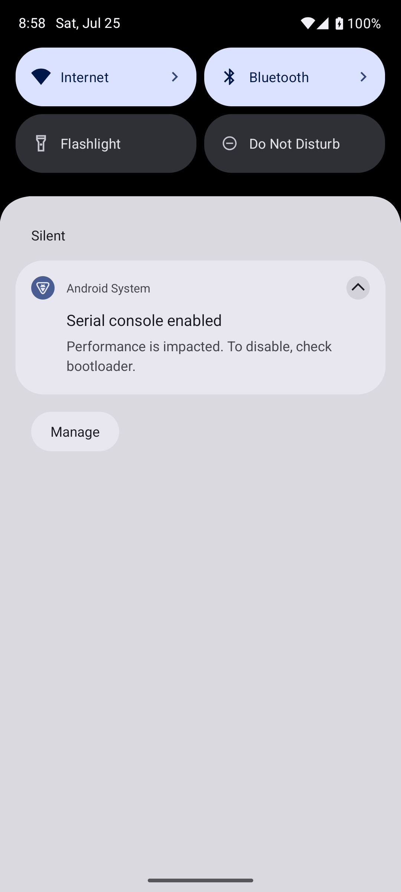

# Pesky Reminders

An Android app for reminders you **cannot swipe away**.

You add a task and pick when to be nagged. At that time a notification fires that
you can't dismiss. The only ways to clear it are the notification's own two actions:

- **Snooze** — opens a picker: 5 / 15 / 30 / 60 minutes, or a wheel running from
  15 minutes to 3 days (quarter-hours early on, coarsening as it goes). Past three
  hours each entry also shows the clock time it lands on — `4h (21:00)`.
- **Done** — clears it for good.

## The app

| Task list | New pester sheet | Calendar picker |
|-----------|------------------|-----------------|
| Overdue / Up next / Done | shortcut chips + scroll wheels | month grid + time chips |

- **Task list** — an *Overdue* section (crimson, the same accent as everything else
  that shouts), *Up next*, and a collapsible *Done* section with struck-through rows.
  Ticking a repeating task rolls it forward to its next occurrence instead of
  completing it. Rows glide between sections rather than jumping.
- **Long-press a task** for its menu: *Reschedule* — a preset or a quarter-hour dial
  — or mark it done / not done. Rescheduling always counts from now, so "30 minutes"
  means half an hour from the moment you asked; on a task that was not due for hours,
  that pulls it earlier.
- **Delete** — also in the long-press menu. The only way to be rid of a repeating
  task, since ticking one off just rolls it forward.
- **CLEAR** — open the *Done* section and it offers to throw the completed list away.
  Both deletes ask first: there is no undo anywhere in the app.
- **New pester sheet** — a name, then a time picked whichever way suits: six shortcut
  chips (*Later today*, *Tonight*, *This weekend*, …), three scroll wheels
  (day / hour / minute), or a month calendar with an hour stepper and time-of-day
  chips. Plus a repeat rule: Once / Daily / Weekly / Monthly.
- **Settings** — a reminder you ignore keeps buzzing until you snooze it or tick it
  off. That is on by default every 5 minutes, and both the on/off and the interval
  (1–180 minutes) are configurable from the sliders icon in the header.
- Tasks persist across restarts (SharedPreferences), and each one gets its own
  independent alarm and notification.

The icon is a ringing bell — the same bell the app uses in its empty state, with
a motion arc either side — shipped as an adaptive icon plus a monochrome
status-bar silhouette.

The UI is a port of the "Pesky Reminders v2" Claude Design canvas — warm near-black
surfaces, Bricolage Grotesque for the display type and DM Sans for everything else.
The single accent is a crimson (`#D12744`) sampled from an "uscita / exit" sign; the
design's original orange was swapped for it.

## Does the notification model actually work?

Yes — and it's proven, not just claimed. See [`docs/verification/VERIFICATION.md`](docs/verification/VERIFICATION.md).

- Automated: JVM unit tests + on-device instrumented tests. The key test fires the
  notification's *own* delete-intent — exactly what Android sends on a user swipe —
  and asserts the notification re-posts.
- Manual demo (screenshots in `docs/verification/`): the reminder fires, is swiped
  away, and **immediately reappears**; then **Done** clears it for good.

| Fired | Swiped → re-posted | Done → gone |
|-------|--------------------|-------------|
|  |  |  |

## How it works

- **Scheduling:** `AlarmManager.setAlarmClock()` (exact, Doze-friendly) with the
  `USE_EXACT_ALARM` permission — no runtime prompt for a reminder app. Each task
  owns its own alarm, notification id, and PendingIntent request codes.
- **Un-dismissability:** the notification is `setOngoing(true)` **and** carries a
  `deleteIntent`. On Android 14+ the ongoing flag no longer blocks an individual
  swipe, so the delete-intent is the real guarantee: whenever the notification is
  dismissed, the OS fires the delete-intent and the app re-posts it. Snooze and Done
  clear it via `NotificationManager.cancel()`, which does **not** fire the
  delete-intent — so only they can actually make it go away.
- **Surviving a reboot:** pending alarms are dropped when the device restarts (and
  when the app is updated), so a `BootReceiver` re-arms them from the stored task
  list on `BOOT_COMPLETED` / `MY_PACKAGE_REPLACED`. Anything that came due while the
  device was off is posted right away rather than quietly lost.
- **No foreground service, no full-screen intent.**

All control flow runs through a single `BroadcastReceiver` (`ReminderReceiver`)
handling four actions: `FIRE`, `REPOST`, `SNOOZE`, `DONE`. Both the receiver and the
UI mutate state through one facade (`Reminders`), so tapping *Done* in the
notification and ticking the task in the app take exactly the same path.

## Requirements

- JDK 17
- Android SDK with platform 35, build-tools 35, an emulator or a device (min SDK 26)
- The Gradle **wrapper** is included (`./gradlew`, pinned to 8.11.1) — don't use a
  system Gradle.

If `adb`/`emulator` aren't on your PATH, export the SDK location first (adjust to
your SDK path):

```bash
export ANDROID_HOME="$HOME/Library/Android/sdk"   # or /opt/homebrew/share/android-commandlinetools
export PATH="$ANDROID_HOME/platform-tools:$ANDROID_HOME/emulator:$ANDROID_HOME/cmdline-tools/latest/bin:$PATH"
```

## Build & run

```bash
# Build and install the debug app on a running emulator/device
./gradlew :app:assembleDebug
adb install -r app/build/outputs/apk/debug/app-debug.apk
adb shell am start -n com.peskyreminders.poc/.MainActivity
```

Tap **+**, type something, pick a time, tap **Pester me**. When the reminder fires,
try to swipe it away — it comes back. Tap **Done** to clear it.

## Test

```bash
./gradlew :app:testDebugUnitTest          # 148 deterministic tests, JVM only, ~7s

# Instrumented tests need a running emulator/device.
# (connected-test tasks use the property form, not --tests)
./gradlew :app:connectedDebugAndroidTest \
  -Pandroid.testInstrumentationRunnerArguments.class=com.peskyreminders.poc.ReminderModelTest
```

The JVM suite needs no device: Robolectric hosts the real composables, and every
screen takes "now" as a parameter instead of reading the clock, so every expected
label is a fixed string and the tests can't drift with the date. It covers the date
maths and drives every control in the list and the add sheet. The instrumented suite
covers what only a device can: the alarm and the un-dismissable notification. Note
that running it **clears the task list on the device**.

To make the JVM suite gate your pushes:

```bash
git config core.hooksPath .githooks    # once per clone; bypass with --no-verify
```

## Releases

Versioning is semver, with `versionName` in `app/build.gradle.kts` as the single
source of truth; it's bumped once per branch/session. Release APKs are auto-named
`pesky-reminders-X.Y.Z.apk`.

Published releases (tag `vX.Y.Z`, APK attached) are cut with the `release` skill in
`.claude/skills/release/`.

## Download the APK

A debug-signed **release** APK can be served locally on port 9999:

```bash
./gradlew :app:assembleRelease
mkdir -p dist && cp app/build/outputs/apk/release/pesky-reminders-*.apk dist/pesky-reminders.apk
cd dist && python3 -m http.server 9999 --bind 0.0.0.0
```

Then download from `http://localhost:9999/pesky-reminders.apk` (or
`http://<your-LAN-ip>:9999/pesky-reminders.apk` from a phone on the same Wi-Fi).
The release build is debug-signed for easy sideloading; a real release needs its
own keystore.

## Scope

Intentionally **not** included: editing a task — the design has none, so a typo
means delete and re-add. There is also no undo: both deletes confirm first instead.
See `docs/` for the full spec, plan, and verification.
