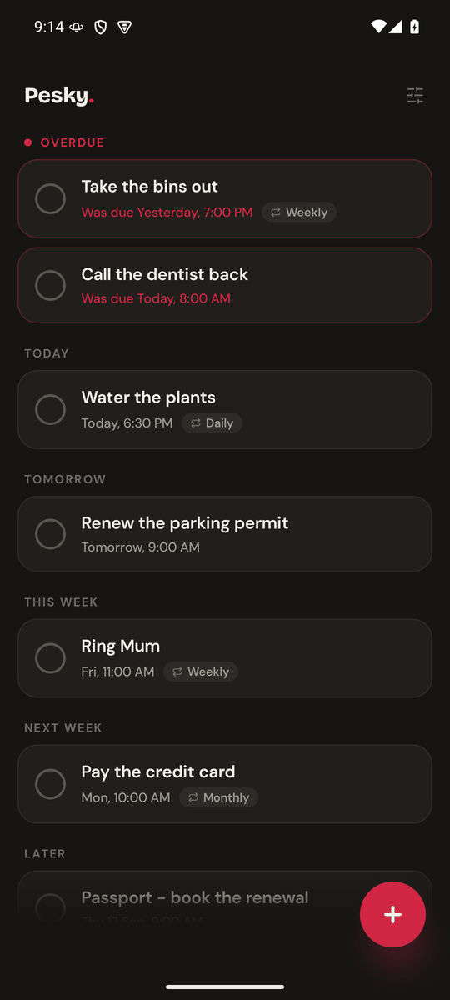
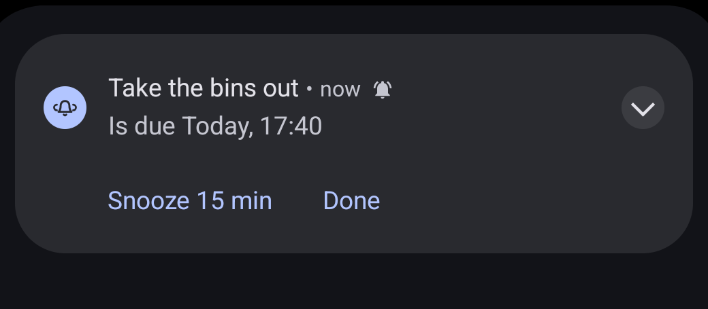
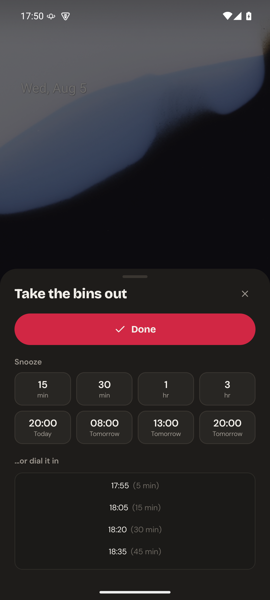
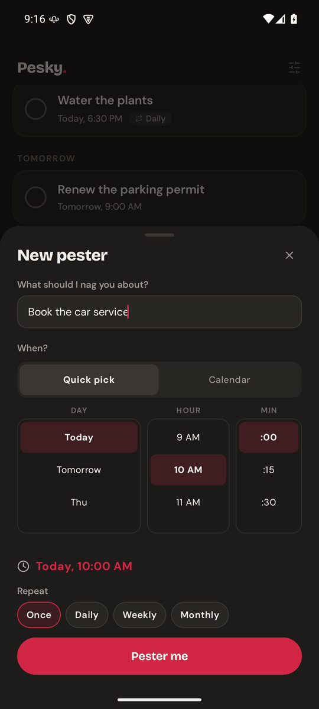
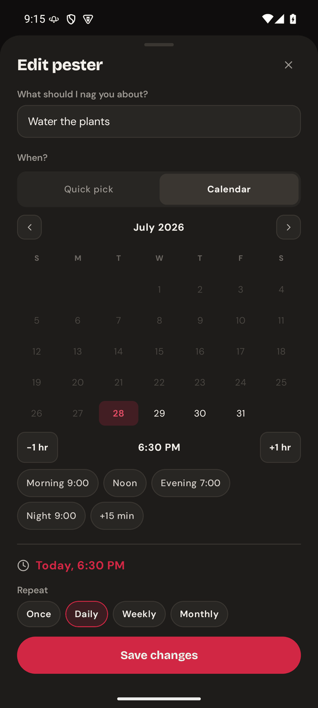

# Pesky Reminders

A reminder app for things you keep not doing.

Every other app puts a notification on your lock screen, you flick it away without
reading it, and the thing stays undone. Pesky won't let you. Its notification cannot
be swiped away, cannot be cleared, and comes straight back if you try. The only ways
out are its own two buttons — **Snooze 15 min** and **Done**, one tap each — or the
sheet a tap on its body opens, where every other snooze lives.



## When one goes off



It arrives like any other notification — and then it stays.

- **Swipe it away** and it reappears immediately, in the same place, with the same
  two actions — and this time without a sound or a buzz. It came back; that is the
  whole statement, and answering a swipe with a chime reads as the app arguing.
- **Clear all** skips it. So does clearing from the lock screen.
- If you leave it sitting there it **buzzes again every 5 minutes** until you deal
  with it. (You can change the interval, or switch the nagging off — see Settings.)
  It buzzes, it doesn't chime: the sound belongs to the reminder *arriving*, once.
  A notification tone every five minutes is how an app gets uninstalled.
- **Snooze 15 min** does exactly that, on one tap, and tells you where it landed. It
  is the answer often enough that stopping to ask which duration was the slower path,
  and a quarter of an hour is the one that is hardest to regret.
- **Tap the body** for any other snooze. That opens the sheet, which has the whole
  ladder — out to three days — and floats over whatever you were doing rather than
  opening the app; once you've chosen it gets out of the way and puts you back there.

The wording stays in the present tense — *"Is due Today, 08:00"* — however late it
is. It's on your screen because the thing still wants doing.



**Done** is the filled pill at the top — one tap and it's finished. Below it, under a
single **Snooze** heading, are two rows of chips. The first is durations: 15 min,
30 min, 1 hr, 3 hr. The second names times of day instead — *20:00 Today*,
*08:00 Tomorrow*, *13:00 Tomorrow* — always the next four still ahead of you, so at
14:00 today's morning and afternoon are simply gone and the row starts at this
evening. It's for the intent a duration is clumsy at: not "in three hours" but
"tomorrow morning".

Everything else is in the wheel underneath, starting at 5 minutes out and running to
three days, coarsening as it goes (quarter-hours, then half-hours, then hours, then
six-hour jumps). Every row **leads with the clock time it lands on** — *17:50 (5 min)*,
*19:15 (3h)* — because the time is the thing you're actually choosing; the duration
that got you there is the note beside it.

There's no confirm button anywhere in the sheet: whichever chip or wheel row you tap is
the choice, committed the instant you tap it. The *durations* count from **now**, never
from when the reminder was originally due; the time chips land on exactly the time they
show.

## The list

The screen at the top of this page: everything you've asked to be nagged about, in
the order it's coming at you — **Overdue**, **Today**, **Tomorrow**, **This week**,
**Next week**, **Later**. Bands with nothing in them simply aren't there, so the list
is never padded with empty headings.

- **Overdue is the loud one.** Crimson outline, crimson text, a dot in the heading.
  A task leaves *Today* the moment it's late, so being overdue is never something you
  have to squint for.
- **Tap the circle** to tick a task off. It slides down into *Done*, struck through.
  Tap it again to bring it back.
- **Tap an overdue task** and you get the same sheet the notification opens — Done,
  the four chips, the wheel. Once something is late the question is almost always
  "finished, or not now?", so that's what the tap asks. Tapping anything that isn't
  late opens it for editing, as before.
- **Hold any task** to edit it, whatever band it's in. That's the way to rename or
  reschedule something overdue — and the way to reach **Delete** on a repeater
  that's gone red.
- **A repeating task never gets ticked off** — it rolls forward to its next
  occurrence instead. Tick the daily *Water the plants* and it comes back tomorrow
  at 6:30pm.
- Try to tick a repeater **before** its time has come and nothing happens, but the
  app says why: *"Not due until Tomorrow, 8:00 AM."* Rolling it forward early would
  throw away the occurrence you could still act on.
- **Done** collapses out of the way and keeps a count. Open it and a **CLEAR** button
  appears, which throws the whole completed list away — after asking first, since
  nothing in this app can be undone.

## Adding something

<table>
<tr>
<td></td>
<td></td>
</tr>
</table>

The **+** button opens one sheet: what to nag you about, when, and how often.

A time is always already chosen — about an hour from now, rounded to the hour, or
tomorrow morning at 8:00 if it's already late in the evening. So the name is the only
thing you actually have to fill in, and the button at the bottom stays greyed out
until you do. It's also the only thing the sheet can't guess, so **the keyboard is
already up** when the sheet opens, capitalised and waiting. Tap anywhere else — a
wheel, a chip, the empty space — and it gets out of the way. (Opening an *existing*
task doesn't do this: that's usually a trip to change the time, and the keyboard
would be sitting on top of the pickers.)

Pick the time whichever way suits:

- **Quick pick** — three wheels: the day (a fortnight of them), the hour, and
  quarter-hour minutes. Fastest for "tomorrow morning".
- **Calendar** — a month grid for anything further out, with `−1 hr` / `+1 hr` either
  side of the time and shortcuts for *Morning 9:00*, *Noon*, *Evening 7:00*,
  *Night 9:00* and *+15 min*.

Either way, the crimson line above **Repeat** is the truth: *Today, 10:00 AM*. Then
choose **Once**, **Daily**, **Weekly** or **Monthly**, and hit **Pester me**.

Changed your mind? Every sheet in the app can be **dragged away by the bar at the
top** — take hold of the grabber or the title and throw it downwards, and it goes.
Let go too early and it springs back. The **✕** and a tap outside still work; this is
just the one your thumb is already near.

## Changing your mind

**Tap a task** — anywhere on the row except the circle — and the same sheet opens on
it, seeded with its name, its time and its repeat rule. Change whatever you like and
press **Save changes**; nothing moves until you do.

The one exception is **Delete**, which appears only on repeating tasks and acts
straight away. A repeater can't be ticked off and can't reach the done list, so
deleting it is the only way to be rid of it. One-off tasks don't get the row: tick
them off and clear the done list instead.

## Settings

The sliders icon in the header opens one sheet. **Keep buzzing** is what makes a
reminder you're ignoring buzz again rather than sit there quietly; it's on by
default, every 5 minutes, and the interval takes anything from 1 to 180 minutes.
Turn it off and the notification still won't go away — it just stops making noise
about it.

## Things worth knowing

- **It survives a restart.** Reminders are re-armed when the phone reboots or the app
  updates, and anything that came due while the phone was off is posted the moment
  it comes back rather than quietly lost.
- **There's no undo.** Deleting a task and clearing the done list both ask first,
  because that's the only safety net there is.
- **Getting rid of a one-off takes two steps** — tick it off, then clear the done
  list. Only repeating tasks get a Delete button.
- **The wheels can't always point at your task.** If something is due next month, or
  sitting at 9:07 after a snooze, the wheels show nothing selected — the readout
  underneath still states the real time, and the calendar opens on the right month.
- **It asks for one permission**, to post notifications. There's no account, no
  network, no sync; the list lives on your phone.

## Get it

Grab `pesky-reminders-*.apk` from the [Releases](../../releases) page and sideload it.
Android 8.0 or newer.

## Build it yourself

```bash
./gradlew :app:assembleDebug          # build
./gradlew :app:testDebugUnitTest      # the fast test suite, no device needed
./gradlew :app:connectedDebugAndroidTest   # the on-device suite (wipes the task list)
```

The interesting test is `ReminderModelTest`: it fires the notification's *own*
delete-intent — exactly what Android sends when you swipe — and asserts the
notification comes back. Proof that the whole premise holds is in
[`docs/verification/VERIFICATION.md`](docs/verification/VERIFICATION.md); the design
and the plan behind the app are in [`docs/`](docs/), and
[`CLAUDE.md`](CLAUDE.md) covers how the code is put together.
